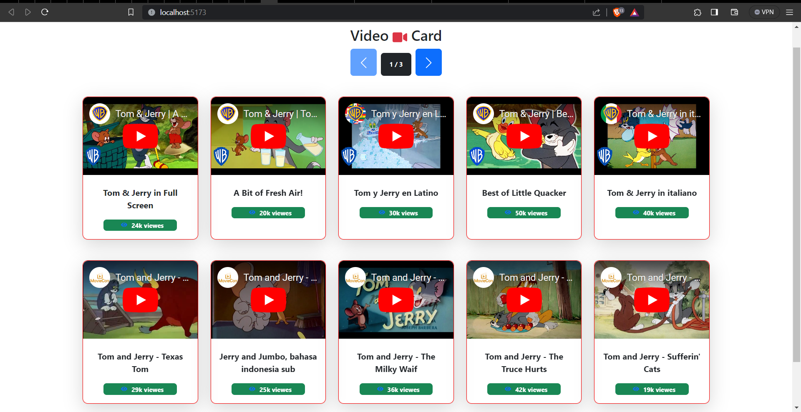

# VideoCard

## Description

The project fetches video urls from an api using `fetch` and renders them as video cards.
The Designed JSON api data in added to `db.json`.

Since the mock-api-server doesn't support pagination, Its done on client-side.

For styling, Bootstrap framework is used.

For the backend a mock server, `json-server` library is used. The dummy API response is added to `db.json`.

### Steps to run

```
npm install
npm run server
npm run dev
```

## Output


